# Investigaciones Geográficas Interactivas para la Mejora
| Proyecto | Vista Previa | Descripción | Enlace |
|----------|-------------|-------------|--------|
| **[Indicadores de Trata Infantil](http://sigeh.hidalgo.gob.mx/pags/Tablero_Turismo/)** |  | Mapa interactivo que muestra tipos de delitos, sitios turísticos y empresas del sector. Incluye gráficos sobre la población de 5 a 17 años en ocupaciones no permitidas. | [🔗 Ver más](http://sigeh.hidalgo.gob.mx/pags/Tablero_Turismo/) |
| **[Análisis de Tomas Clandestinas de Agua](http://sigeh.hidalgo.gob.mx/pags/tomas_clandestinas/)** |  | Mapa interactivo que muestra tanto los usuarios con tomas de agua como las tomas clandestinas. | [🔗 Ver más](http://sigeh.hidalgo.gob.mx/pags/tomas_clandestinas/) |
| **[Índice de Prioridad Alimentaria](http://sigeh.hidalgo.gob.mx/pags/alimentario/)** |  | Mapa interactivo con comedores y su índice de prioridad alimentaria. | [🔗 Ver más](http://sigeh.hidalgo.gob.mx/pags/alimentario/) |
| **[Aptitud Rellenos Sanitarios](http://sigeh.hidalgo.gob.mx/pags/rellenos/)** |  | Mapa sobre la capacidad de rellenos sanitarios con una paleta de colores. | [🔗 Ver más](http://sigeh.hidalgo.gob.mx/pags/rellenos/) |
| **[Emisión de Gases de Efecto Invernadero](http://sigeh.hidalgo.gob.mx/pags/semarnath/)** |  | Mapa interactivo que muestra la emisión de metano por la crianza de bovinos o porcinos, las emisiones en SDF y las acciones de mitigación. | [🔗 Ver más](http://sigeh.hidalgo.gob.mx/pags/semarnath/) |
| **[Incidentes con Fauna Feral](https://jairesc.github.io/Aprendizaje//Leaflet/mapa_mordedura_perros.html)** |  | Mapa interactivo que resume incidentes con perros y gatos salvajes. | [🔗 Ver más](https://jairesc.github.io/Aprendizaje//Leaflet/mapa_mordedura_perros.html) |
| **[Movilidad](http://sigeh.hidalgo.gob.mx/pags/movilidad/)** | 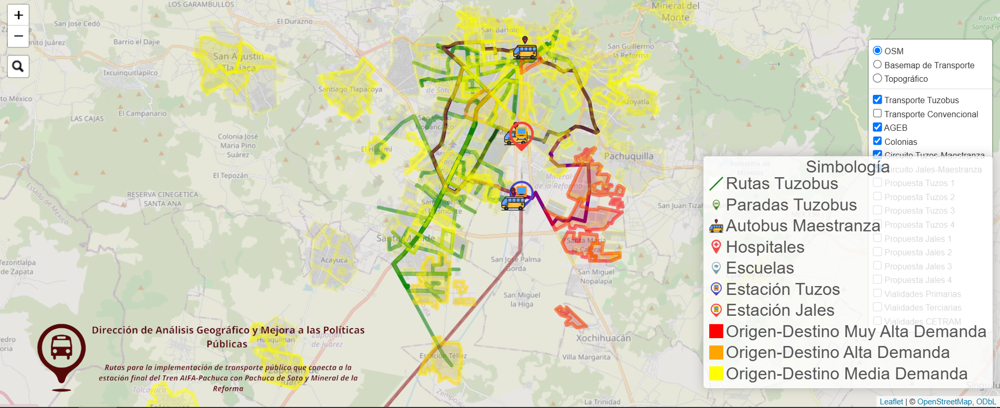 | Mapa interactivo sobre las rutas de transporte público conectando la estación final del Tren AIFA-Pachuca con Pachuca de Soto y Mineral de la Reforma. | [🔗 Ver más](http://sigeh.hidalgo.gob.mx/pags/movilidad/) |
| **[Oportunidades/Problemáticas Hidalgo](http://sigeh.hidalgo.gob.mx/pags/OportunidadesHidalgo/)** |  | Mapa con las principales problemáticas de cada municipio, categorizadas por sector. | [🔗 Ver más](http://sigeh.hidalgo.gob.mx/pags/OportunidadesHidalgo/) |
| **[Tablero Indicadores Turismo](http://sigeh.hidalgo.gob.mx/pags/IndicadoresTurismo/)** |  | Mapa con sitios turísticos y gráficos sobre turistas y PIB turístico. | [🔗 Ver más](http://sigeh.hidalgo.gob.mx/pags/IndicadoresTurismo/) |
| **[Complejidad Económica 2024](http://sigeh.hidalgo.gob.mx/pags/complejidad/)** |  | Sitio que explica el cálculo del índice de complejidad económica y su código en R. | [🔗 Ver más](http://sigeh.hidalgo.gob.mx/pags/complejidad/) |
| **[Gasoducto](http://sigeh.hidalgo.gob.mx/pags/gasoducto/)** |  | Mapa del proyecto Tuxpan-Tula TransCanada. | [🔗 Ver más](http://sigeh.hidalgo.gob.mx/pags/gasoducto/) |
| **[Tablero de Indicadores Nacional e Histórico](http://sigeh.hidalgo.gob.mx/pags/tablero_indicadores/)** |  | Sitio interactivo con indicadores sobre medio ambiente, economía, gobierno y sociedad. | [🔗 Ver más](http://sigeh.hidalgo.gob.mx/pags/tablero_indicadores/) |
| **[Tablero de Incidentes Delictivos](http://sigeh.hidalgo.gob.mx/pags/seguridad/)** | 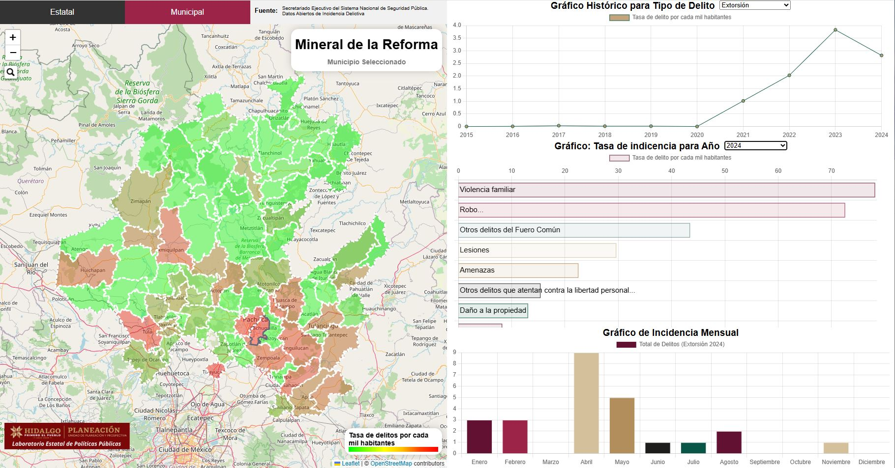 | Sitio interactivo con datos según tipo de delito en el estado de Hidalgo. Información actualizada a Marzo 2025 | [🔗 Ver más](http://sigeh.hidalgo.gob.mx/pags/seguridad/) |
| **[Tablero de Complejidad Económica](https://jaires-tablero-economia-dash.share.connect.posit.cloud/)** | 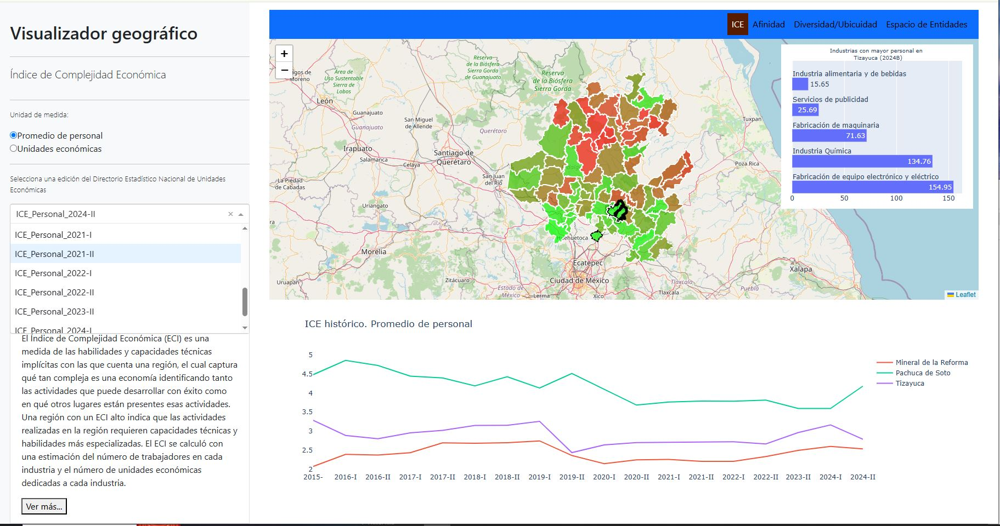 | Sitio interactivo con indicadores de complejidad económica para Hidalgo.  **Link externo.** **[Link SECODI](http://sigeh.hidalgo.gob.mx:81/)** | [🔗 Ver más](https://jaires-tablero-economia-dash.share.connect.posit.cloud/) |
| **[Actividades Económicas](https://jaires-actividades-complejidadgif.share.connect.posit.cloud/)** | 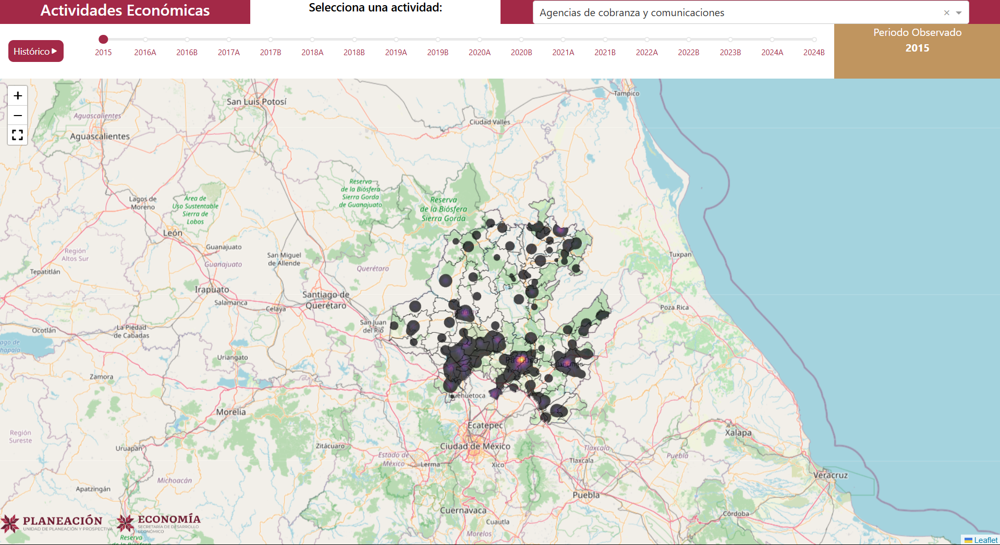 | Mapa web interactivo, que muestra un kernel de densidad de la actividad económica elegida para un período específico.  **Link externo.** **[Link SECODI](http://sigeh.hidalgo.gob.mx:8050/)** | [🔗 Ver más](https://jaires-actividades-complejidadgif.share.connect.posit.cloud/) |
| **[Indicadores de Calidad del Agua](http://sigeh.hidalgo.gob.mx:8080/)** | 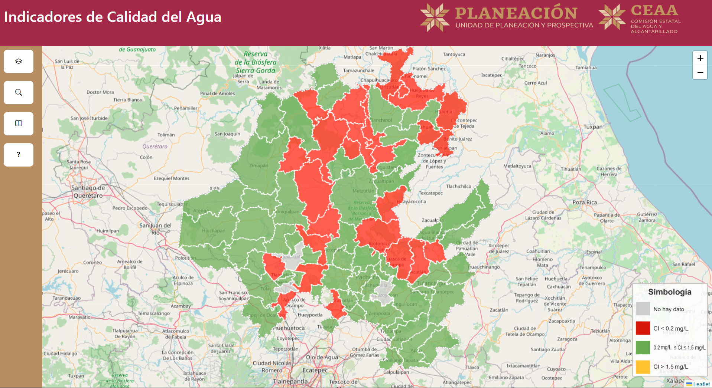 | Mapa web interactivo que muestra los niveles de cloro residual libre por municipio y por región, según el año seleccionado. | [🔗 Ver más](http://sigeh.hidalgo.gob.mx:8080/) |
| **[Accidentes vehiculares](http://sigeh.hidalgo.gob.mx/pags/accidentes_vehiculares/)** | 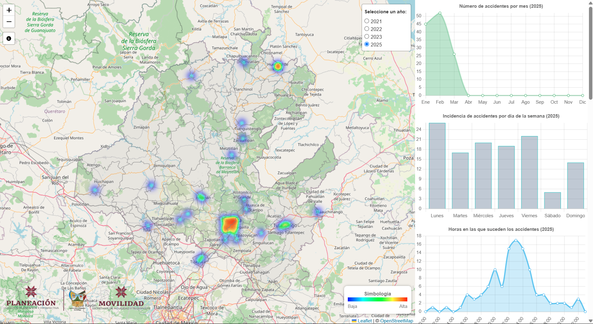 |Mapa web interactivo que muestra los accidentes en el estado de Hidalgo según el año elegido, junto con gráficas que se actualizan según la información mostrada. | [🔗 Ver más](http://sigeh.hidalgo.gob.mx/pags/accidentes_vehiculares/) |
| **[Indice de Competitividad](https://github.com/SIGEHgo/Investigaciones-geograficas-interactivas-para-la-mejora/blob/aaf666df967eb68aff73c31783df38ef09e3708e/Imagenes/IMCO%20Indicadores.xlsx)** | 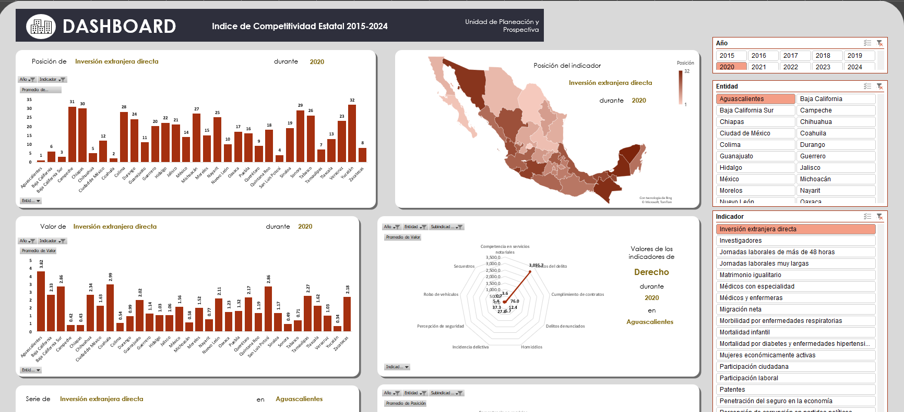 | DasBoard sobre el Indice de Competitividad Estatal 2015-2024  | [🔗 Ver más](https://github.com/SIGEHgo/Investigaciones-geograficas-interactivas-para-la-mejora/blob/aaf666df967eb68aff73c31783df38ef09e3708e/Imagenes/IMCO%20Indicadores.xlsx) |
| **[Analisis de Incidentes](http://sigeh.hidalgo.gob.mx/post/seguridad1/)** | 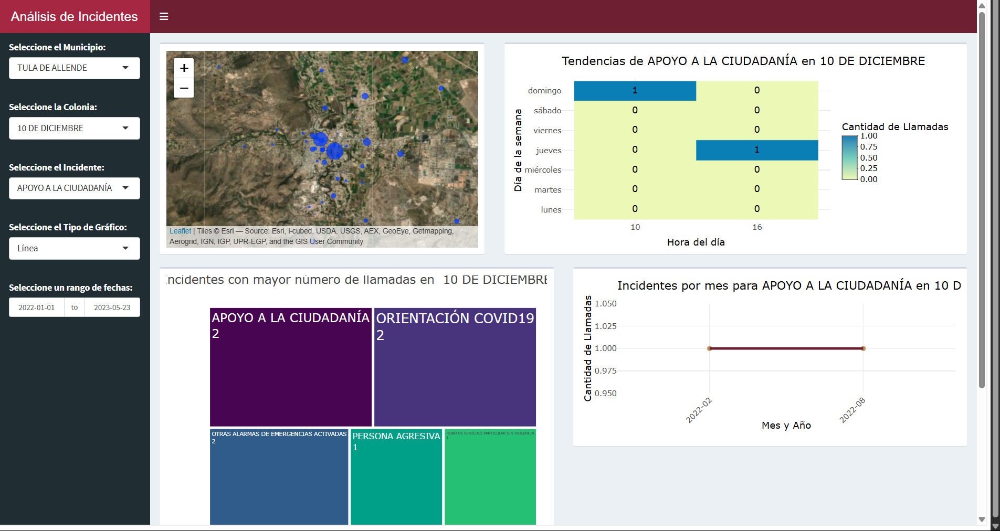 |  Sitio web interactivo que muestra los incidentes reportados al 911, incluyendo gráficas según la zona seleccionada. | [🔗 Ver más](http://sigeh.hidalgo.gob.mx/post/seguridad1/) |
| **[Banco Unico de Información Estadistica](http://p-sigeh.hidalgo.gob.mx/buie/)** | 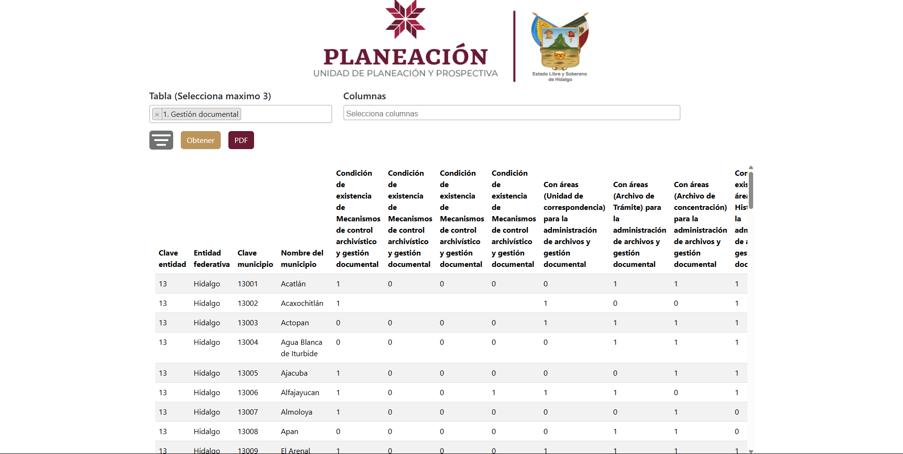 | Sitio web que te permite acceder, filtrar, visualizar y obtener información oficial sobre diversos sectores del estado de Hidalgo. | [🔗 Ver más](http://p-sigeh.hidalgo.gob.mx/buie/) |
| **[Indicadores de Desempeño Municipal](http://sigeh.hidalgo.gob.mx:3000/)** | 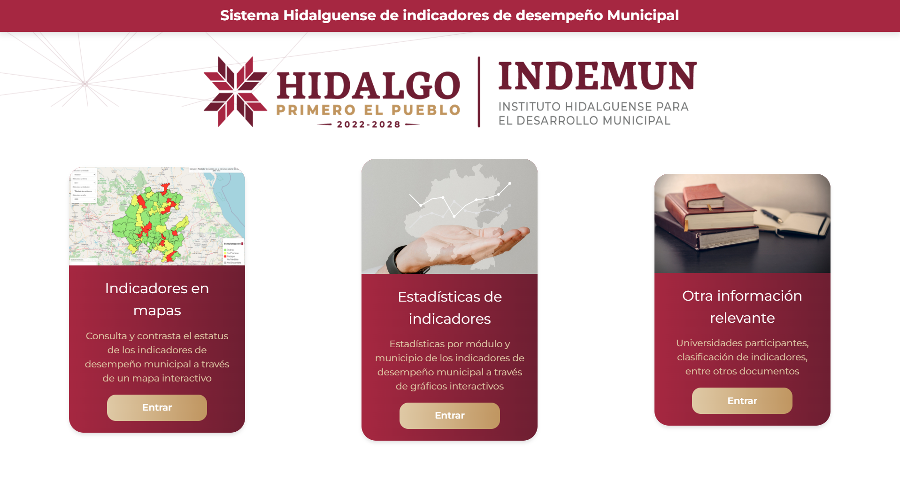 | Sitio web sobre el Sistema Hidalguense de Indicadores de Desempeño Municipal(INDEMUN) el cual tiene los indicadores en mapas, Estadisticas de indicadores y Otra información relevante | [🔗 Ver más](http://sigeh.hidalgo.gob.mx:3000/) |
| **[Oportunidad Hidalgo Nuevo](http://sigeh.hidalgo.gob.mx/pags/OportunidadesHgo/)** |  | Pendiente | [🔗 Ver más](http://sigeh.hidalgo.gob.mx/pags/OportunidadesHgo/) |
| **[Pobreza por Localidad](http://sigeh.hidalgo.gob.mx/pags/pobreza_localidad/)** | 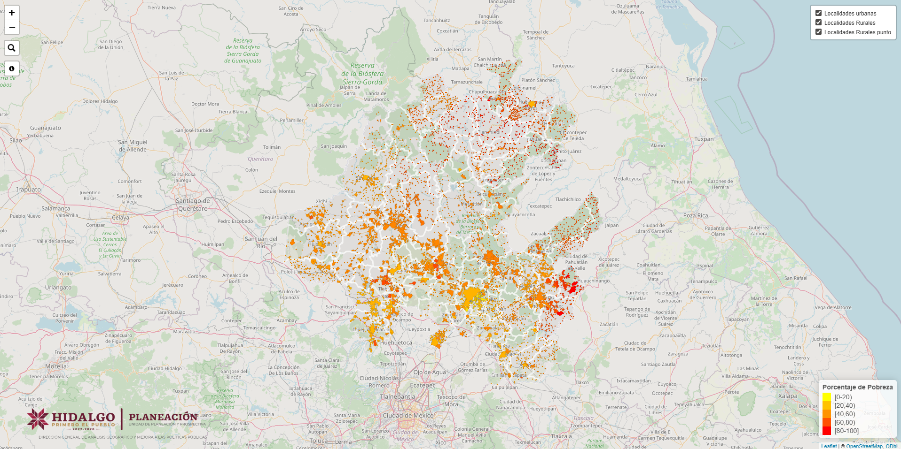 |Mapa web interactivo que muestra el porcentaje de pobreza a nivel localidad.  | [🔗 Ver más](http://sigeh.hidalgo.gob.mx/pags/pobreza_localidad/) |
| **[Obras SIPDUS](http://sigeh.hidalgo.gob.mx/pags/mun_inv3a/)** | 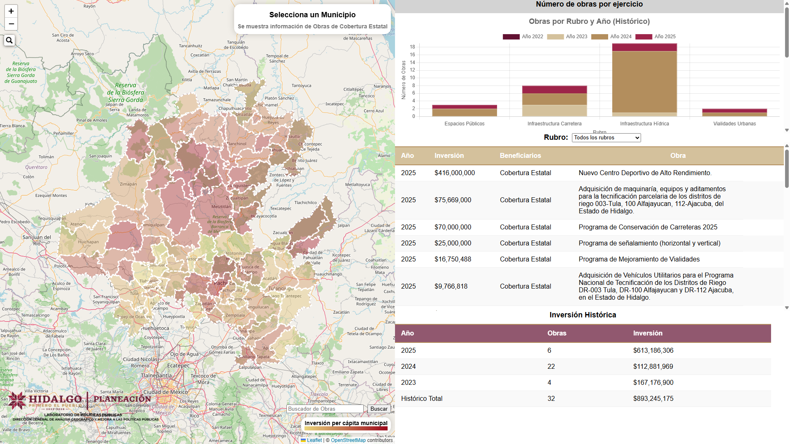 | Mapa web interactivo que muestra las obras a nivel municipal, ademas de graficas y tablas interactivas que muestra de manera mas detallada los datos sobre lo observado. | [🔗 Ver más](http://sigeh.hidalgo.gob.mx/pags/pobreza_localidad/](http://sigeh.hidalgo.gob.mx/pags/mun_inv3a/)) |
| **[Progreso Censo de Gobierno](https://sigehgo.github.io/Progreso-Censos-de-Gobiernos/)** | 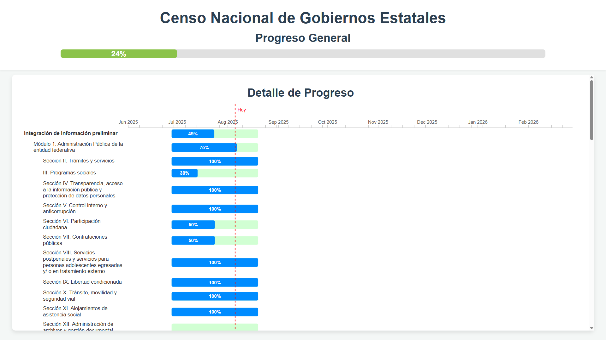 | Sitio web que te permite observar el avance del Censo de Gobierno en los diversos módulos y secciones. | [🔗 Ver más](https://sigehgo.github.io/Progreso-Censos-de-Gobiernos/) |
| **[Emergencias](https://sigehgo-emergencias.share.connect.posit.cloud)** | 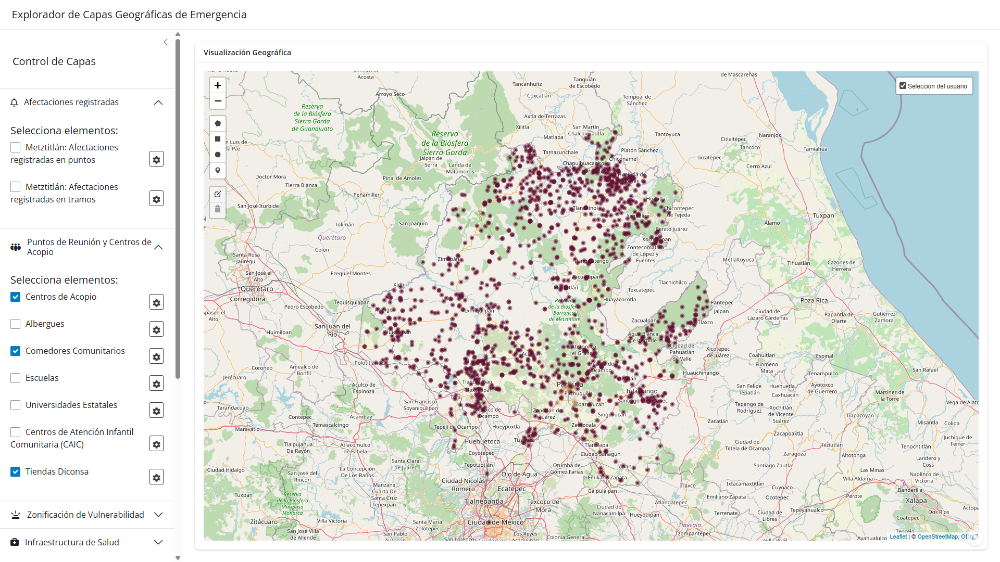 | Mapa web para la exploración de capas geográficas relacionadas con emergencias, que integra diversos temas como afectaciones registradas, puntos de reunión y centros de acopio, zonificación de vulnerabilidad, infraestructura de salud, recursos hídricos, entre otros. El mapa web permite seleccionar las capas de interés, ajustar sus parámetros y realizar figuras personalizadas para facilitar el análisis y la toma de decisiones en situaciones de emergencia. | [🔗 Ver más](https://sigehgo-emergencias.share.connect.posit.cloud) |
| **[Vialidades de mayor tránsito en el estado de Hidalgo y su percepción](https://sigehgo-emergencias.share.connect.posit.cloud)** |  | Documento que a través de un análisis define cuáles son las vías más transitadas en el estado | [🔗 Ver más](https://sigehgo-emergencias.share.connect.posit.cloud) |
| **[Estimación de la Aptitud para Desarrollo Urbano](https://sigehgo-emergencias.share.connect.posit.cloud)** |  | Metodología que se auxilia de sistemas de información geográfica | [🔗 Ver más](https://sigehgo-emergencias.share.connect.posit.cloud) |
| **[Programas, obras y acciones a nivel de municipios 2022-2025.](https://sigehgo-emergencias.share.connect.posit.cloud)** |  | Metodología que se auxilia de sistemas de información geográfica | [🔗 Ver más](https://sigehgo-emergencias.share.connect.posit.cloud) |
| **[Origenes-Destinos](https://sigehgo-emergencias.share.connect.posit.cloud)** |  | Mapa web interactivo | [🔗 Ver más](https://sigehgo-emergencias.share.connect.posit.cloud) |
